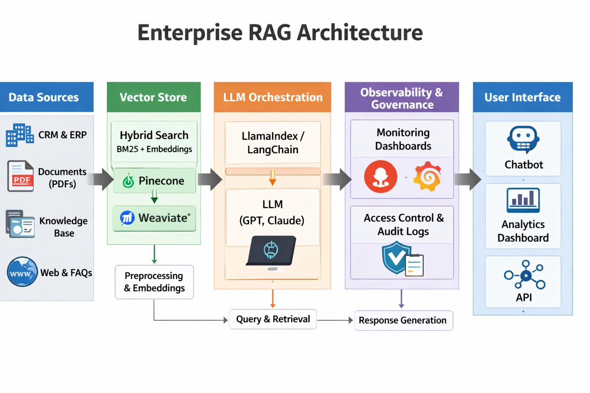

# Enterprise Retrieval-Augmented Generation (RAG) System

## Problem Statement
Enterprises struggle with knowledge retrieval across siloed systems. Traditional search lacks semantic depth, while LLMs hallucinate without grounding.

## Solution
A RAG pipeline that combines semantic embeddings with hybrid retrieval, integrated observability, and governance.

## Design Overview

| Layer | Description |
|-------|-------------|
| **Data Layer** | Document ingestion (PDFs, contracts, CRM exports) |
| **Indexing Layer** | Hybrid retrieval (BM25 + embeddings) |
| **Vector Store** | Pinecone/Weaviate for scalability |
| **LLM Layer** | GPT/Claude for contextual synthesis |
| **Orchestration** | LangChain/LlamaIndex pipelines |
| **Observability** | Prometheus + Grafana dashboards for latency, drift, and cost |
| **Governance** | Access control, audit logs, bias detection |

## Applied Best Practices
- **Hybrid retrieval** ensures both keyword precision and semantic recall
- **Eval harness** (Ragas) for continuous quality measurement
- **Caching and batching** reduce inference costs
- **Modular design** enables reusable components across departments

## Alternatives Considered
| Option | Trade-off |
|--------|-----------|
| **FAISS** | Lightweight, cost-effective for local deployments |
| **ElasticSearch** | Strong for text-heavy corpora, but weaker in semantic embeddings |
| **Milvus** | Open-source, scalable, but heavier ops overhead |

## Limitations
- Latency increases with large-scale queries
- Requires strong data governance to prevent leakage
- Cost optimization critical for enterprise-scale deployments
